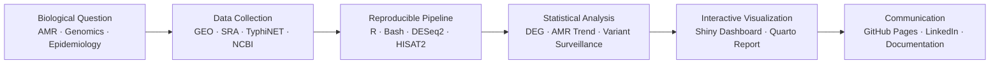
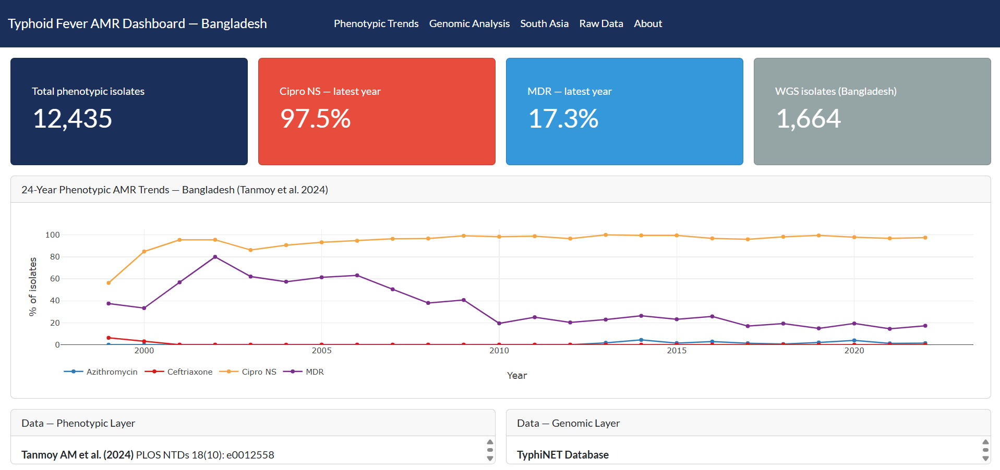
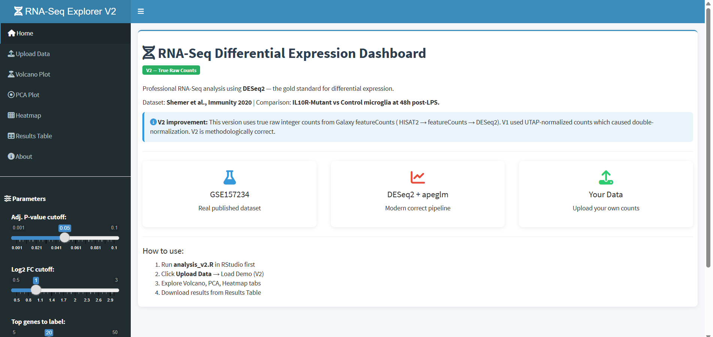
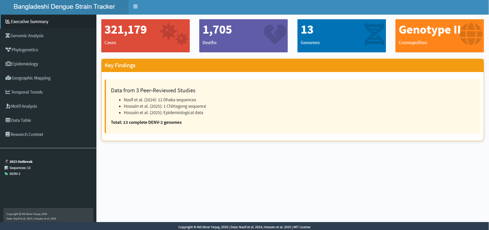
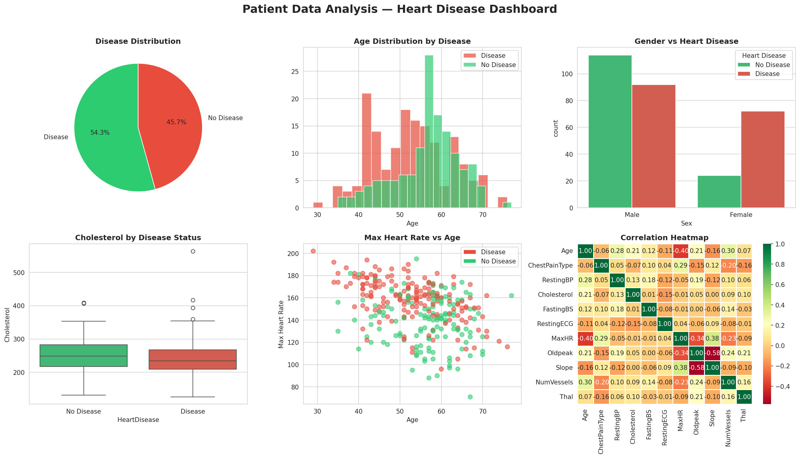

# Hi, I'm Md Abrar Faiyaj 👋

**Junior Research Collaborator | Computational Biologist | Bioinformatics Analyst**  
**Building reproducible pipelines and interactive dashboards for infectious disease genomics and AMR surveillance**

---

## 🔬 What I Work On

I work at the intersection of **infectious disease biology** and **computational data analysis** — turning messy genomic and epidemiological datasets into reproducible, interactive tools that researchers can actually use.

---

## 🧰 Technical Toolkit

**Languages & Frameworks**

**Bioinformatics & Genomics**

**Visualization & Dashboards**

**Tools & Reproducibility**

---

## 🚀 Featured Projects

### 1. Typhoid Fever AMR Surveillance Dashboard — Bangladesh (1999–2022)

A 24-year retrospective analysis of *Salmonella* Typhi antimicrobial resistance trends in Bangladesh, extending Tanmoy et al. 2024 (PLOS NTDs) with TyphiNET genomic data. Fully deployed as an interactive Shiny dashboard and a Quarto report on GitHub Pages.

**Highlights:**
- Integrated clinical AMR phenotype data with whole-genome sequencing genotype data from TyphiNET
- Visualized multi-drug resistance (MDR), XDR, and H58 lineage trends over 24 years
- Deployed interactive Shiny dashboard with tabbed navigation and downloadable outputs
- Published reproducible Quarto report with embedded figures and methodology

**Tech:** `R` `Shiny` `ggplot2` `Quarto` `renv` `GitHub Pages` `TyphiNET` `AMR genomics`

[🔗 View Repository](https://github.com/mdabrarfaiyaj/Typhoid-Fever-in-Bangladesh) · [📊 Live Dashboard](https://u3j9z9-md0abrar-faiyaj.shinyapps.io/typhoid-amr-bangladesh/) · [📄 Quarto Report](https://mdabrarfaiyaj.github.io/Typhoid-Fever-in-Bangladesh)

---

### 2. RNA-Seq Replication — Shemer et al., *Immunity* 2020 (GSE157234)

Reproduced bulk RNA-Seq analysis from a high-impact immunology paper on IL-10 receptor-deficient microglia. Discovered that the GEO deposit contains UTAP-normalized counts (not raw counts) — a methodological finding documented publicly and shared with the research community, attracting engagement from scientists at Illumina, Novartis, Pfizer, and GSK.

**Highlights:**
- Replicated differential expression analysis using DESeq2 with apeglm shrinkage
- Identified 1,563 DEGs with clean mutant/control separation
- Documented GEO data transparency issue publicly, reaching 6,300+ LinkedIn impressions
- V2 pipeline in progress from raw FASTQs via SRA for full methodological rigor

**Tech:** `R` `DESeq2` `apeglm` `ggplot2` `pheatmap` `Shiny` `GEO` `SRA` `Bioconductor`

[🔗 View Repository](https://github.com/mdabrarfaiyaj/rna-seq-shiny-pipeline) · [📊 Live Dashboard](https://019cd22f-689b-acc2-4b56-472725ef4a7b.share.connect.posit.cloud/)

---

### 3. Bangladesh Dengue Genomic Surveillance Dashboard

Interactive R Shiny dashboard analyzing DENV-2 sequences from the 2023 Bangladesh dengue outbreak (Dhaka & Chattogram isolates). Includes QC filtering, motif detection, and comparative visualization.

**Highlights:**
- Analyzed 13 real DENV-2 sequences from the 2023 Bangladesh outbreak
- Detected conserved motifs and visualized variant patterns across isolates
- Deployed interactive dashboard with modern tabbed UI

**Tech:** `R` `Shiny` `Bioconductor` `sequence analysis` `genomic surveillance`

[🔗 View Repository](https://github.com/mdabrarfaiyaj/bangladeshi-dengue-strain-tracker) · [📊 Live Dashboard](https://u3j9z9-md0abrar-faiyaj.shinyapps.io/bangladesh-denv-tracker/)

---

### 4. Heart Disease Patient Data Analysis

Exploratory analysis of 1,025 clinical patient records to identify risk factors for heart disease. Combined Python + SQL workflow with a six-panel diagnostic visualization dashboard.

**Highlights:**
- 8 standalone SQL queries on SQLite for structured data retrieval
- Identified maximum heart rate as the strongest predictor; challenged cholesterol assumptions
- Fully documented, reproducible Jupyter Notebook with biological interpretation

**Tech:** `Python` `SQL` `SQLite` `Pandas` `Matplotlib` `Seaborn` `Jupyter`

[🔗 View Repository](https://github.com/mdabrarfaiyaj/patient-data-analysis)

---

## 📚 Research Interests

- Infectious Disease Genomics & AMR Surveillance
- RNA-Seq & Multi-omics Data Analysis
- Reproducible Bioinformatics Tools & Workflows
- Public Health Data Science
- Computational Biology & Interactive Dashboards

---

## 📫 Let's Connect

- **Email**: faiyaj.mdabrar@gmail.com
- **ORCID**: [0009-0005-9646-4508](https://orcid.org/0009-0005-9646-4508)
- **LinkedIn**: [md-abrar-faiyaj](https://www.linkedin.com/in/md-abrar-faiyaj-559246381/)

Open to **research collaborations**, bioinformatics roles, and PhD opportunities in computational biology and infectious disease genomics.

---

*Last updated: June 2026*
